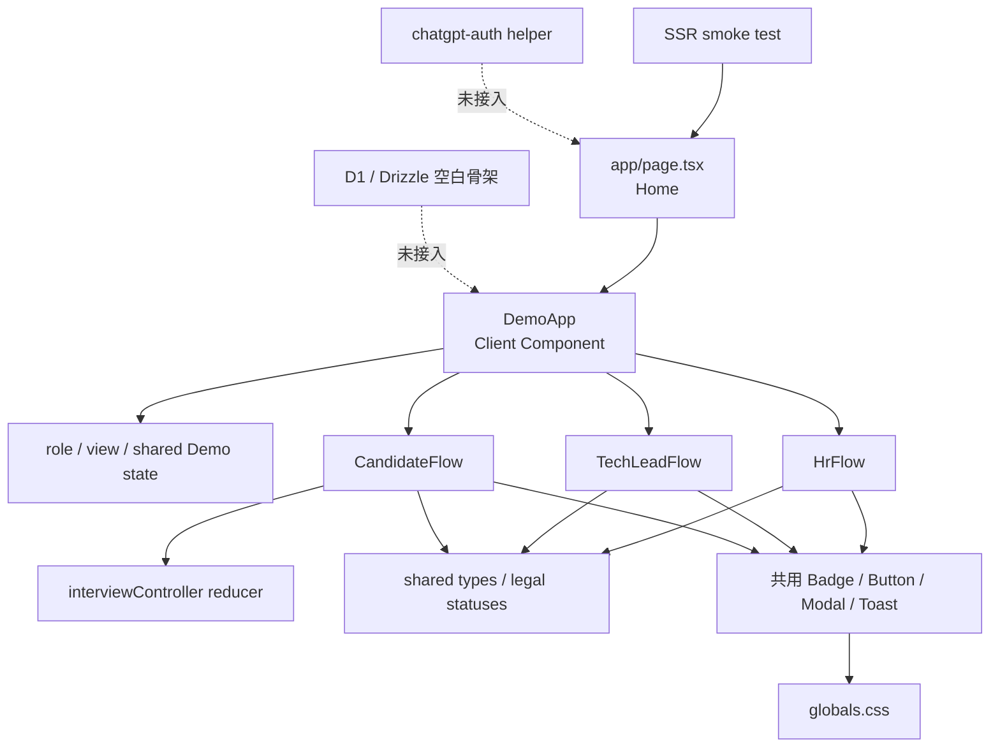
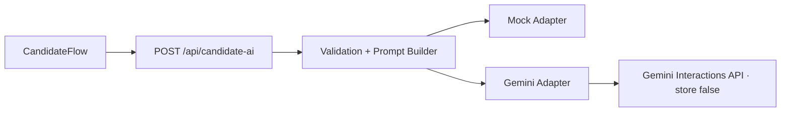
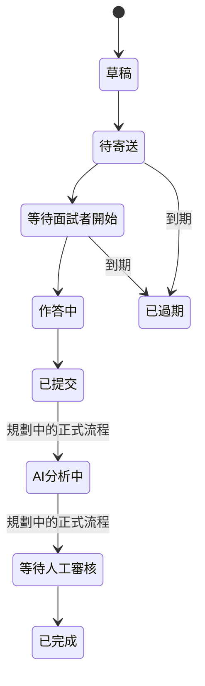
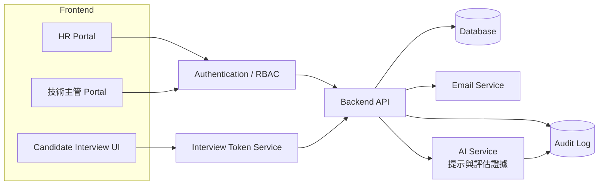

# Talentscope 系統架構與技術說明

> 本文件分開描述「Current MVP」與「Proposed Architecture」。後者是規劃，不代表已實作。

## 1. Current MVP 技術棧

| 層次 | 技術 | 現況 |
|---|---|---|
| UI | React 19.2.6、TypeScript 5.9.3 | `DemoApp.tsx` 協調共用 state；角色 flow 與共用 domain 模組已拆分 |
| App framework | Next.js 16.2.6 App Router | `app/page.tsx`、`app/layout.tsx` |
| Build/runtime | vinext 0.0.50、Vite 8、Cloudflare Worker plugin | `npm run dev/build/start` 皆走 vinext |
| Style | Tailwind CSS 4、PostCSS、手寫 CSS | `@import "tailwindcss"`；畫面主要由 `globals.css` 類別實作 |
| Data | React `useState` 與檔案內常數 | 沒有 API 或資料持久化 |
| Database | Drizzle/D1 骨架 | `db/schema.ts` 為空，D1 binding 未啟用 |
| Test | Node test runner | 純函式／reducer 單元測試與首頁 SSR smoke test |

## 2. 專案目錄結構

```text
.
├─ app/
│  ├─ DemoApp.tsx          # Demo 入口、共用 state、導覽、Modal／Toast 協調
│  ├─ demo/                # 共用型別、資料、UI 與候選人面試 reducer
│  ├─ flows/               # HR、Tech Lead、Candidate 角色流程邊界
│  ├─ globals.css          # 設計 token、元件樣式與 RWD
│  ├─ layout.tsx           # 根 layout 與 metadata
│  ├─ page.tsx             # 唯一路由，掛載 DemoApp
│  └─ chatgpt-auth.ts      # 未接入頁面的可選 auth helper
├─ db/
│  ├─ index.ts             # D1/Drizzle 連線 helper
│  └─ schema.ts            # 目前為空
├─ worker/index.ts         # vinext Cloudflare Worker 入口
├─ tests/                  # domain/reducer 單元測試與 SSR smoke test
├─ docs/                   # Sprint 2 規格基線
├─ package.json
├─ postcss.config.mjs
└─ vite.config.ts
```

`examples/d1/` 是範本示例，不是 Talentscope 目前資料模型。

## 3. 主要模組責任

| 模組／元件 | 責任 | 狀態 |
|---|---|---|
| `Home` | 提供 `/` 路由並掛載 DemoApp | Implemented |
| `DemoApp` | Demo 入口、角色切換、跨角色工作階段 state、Modal／Toast 與角色 flow 組合 | Implemented／Mock data |
| `flows/HrFlow` | HR 畫面分派、候選人複合篩選與新增候選人表單 | Implemented in memory |
| `flows/TechLeadFlow` | 技術主管工作台、題庫、組卷、邀請與審核的畫面邊界 | Implemented UI／Mock service |
| `flows/CandidateFlow` | 驗證、說明、作答、提示、提交與完成；實際使用 reducer | Implemented UI／Mock verification |
| `demo/interviewController` | 倒數、切題、答案更新、手動／逾時單次提交與提交後鎖定 | Implemented pure reducer |
| `demo/types`、`demoLogic` | 共用資料型別、九種合法狀態、篩選與完成度邏輯 | Implemented |
| `Login` | 選擇 HR、技術主管或面試者 Demo | Mock |
| `HrDashboard`、`CandidateList`、`HrSummary` | HR 進度、候選人與招募摘要 | Implemented UI／Mock data |
| `LeadDashboard`、`QuestionBank`、`Builder`、`Invite` | 技術主管工作台、題庫、組卷與邀請 | Implemented UI／Mock service |
| `CandidateFlow` | 驗證、說明、作答、提示、提交與完成 | Implemented UI／Mock verification and persistence |
| `TechReview` | 答案、Mock AI 對話紀錄、AI 初評、人工評分與備註 | Implemented UI／Mock data |
| `Badge`、`Button`、`Toast` 等 | 檔案內共用 UI 元件 | Implemented |

## 4. Current MVP 模組關係圖



## 5. 前端狀態管理

使用 React `useState`，沒有全域 store：

- `role`、`view`：決定目前角色與畫面。
- `selected`：已選題目 ID 與組卷順序。
- `status`：單一 Demo 面試狀態；目前沒有完整狀態機。
- `candidates`、`result`：新增候選人與 HR 結果的工作階段資料。
- `CandidateFlow` 內的面試 reducer：答案、目前題目、剩餘秒數、提交鎖與提交來源；AI 對話另由純 reducer 管理。
- `scores`、`note`：技術主管人工評分與備註。

重新整理頁面會重置全部 state。不同角色畫面雖共享部分 state，但沒有伺服器同步或多使用者一致性。

## 6. Demo 資料與模擬方式

- `demo/data.ts` 提供角色 flow 可用的 12 題、Demo 面試與候選人 typed data；`DemoApp.tsx` 尚保留技術主管既有展示資料，避免本輪大範圍改寫。
- `demoInterview` 與 `seedCandidates` 提供陳怡安等候選人情境。
- 角色切換只修改前端 `role`，不是登入或授權。
- 驗證只比對固定 Email `yian.chen@example.com` 與驗證碼 `482916`。
- `aiConversation.mjs` 以 `interviewId`、`questionId`、`requestId` 管理逐題訊息、pending、error、retry 與提交鎖。
- `app/api/candidate-ai/route.ts` 是前端唯一 AI endpoint；`candidateAIHandler.mjs` 驗證範圍與契約，adapter 依 `AI_PROVIDER` 選擇 Mock 或 Gemini。
- Gemini adapter 使用官方 `@google/genai` Interactions API、`store: false`，不傳 `previous_interaction_id`、不啟用工具；API key 只存在 server environment。



上下文限制為單訊息 2,000 字、同題近期 8 則、prompt 8,000 字、輸出 800 tokens、timeout 15 秒。錯誤正規化為 `invalid_request`、`input_too_long`、`timeout`、`rate_limited`、`provider_unavailable`、`configuration_error`、`safety_blocked`、`unknown_error`。UI Retry 是唯一顯式重試，不建立無限制自動重試。
- AI 初評與證據由 `evals` 固定資料顯示；人工評分只更新當前元件 state。
- Email、複製與自動儲存仍只呈現 UI 或 Toast；倒數與單次提交已由前端 reducer 實作，但不具持久化或後端冪等保證。

## 7. 三角色面試流程

```mermaid
flowchart LR
    HR1["HR 建立候選人"] --> HR2["指派職缺與技術主管"]
    HR2 --> T1["技術主管選題組卷"]
    T1 --> T2["產生 Demo 邀請"]
    T2 --> C1["面試者輸入 Email 與驗證碼"]
    C1 --> C2["閱讀說明並作答"]
C2 --> C3["使用逐題 Mock AI 對話"]

### Sprint 5 AI 模組邊界

`CandidateFlow` 負責輸入與畫面協調，純 reducer 負責對話完整性，Mock service 負責延遲成功／可控失敗。候選人切題時只切換 selector，延遲回覆依原 request 所屬題目落位。資料仍只在記憶體；技術審核的固定 Mock 紀錄未與候選人 state 同步。
    C3 --> C4["提交面試"]
    C4 --> T3["技術主管檢視答案與 Mock AI 初評"]
    T3 --> T4["人工評分、備註與建議"]
    T4 --> HR3["HR 查看摘要"]
    HR3 --> HR4["人類決定通過／不通過／待討論"]
```

上述流程在單一瀏覽器 Demo 中可操作，但沒有跨帳號、跨工作階段或後端事件串接。

## 8. 面試狀態管理

九種合法顯示名稱由 `demoLogic.mjs` 的 `INTERVIEW_STATUSES` 單一 runtime 清單定義，TypeScript 透過共用型別衍生，Badge 也使用同一清單：草稿、待寄送、等待面試者開始、作答中、已提交、AI 分析中、等待人工審核、已完成、已過期。



開始面試、提交與 HR 更新結果會更新同一瀏覽器工作階段的 Demo state；這仍是 **Partial**，不是正式後端狀態機，也不會在重新整理後保存。

## 9. 測試與 Build

- `npm run typecheck`：TypeScript 靜態型別檢查。
- `npm test`：先執行 vinext build，再以 Node test runner 驗證首頁 SSR、三角色入口文字與 starter metadata 已移除。
- `npm run build`：產生 Cloudflare Worker 相容輸出。
- `npm run dev`：啟動 vinext 開發伺服器。
- `npm run lint`：執行 ESLint；Sprint 2 未新增產品程式碼。

目前有 domain/reducer 單元測試與 SSR smoke test；沒有 React 元件測試框架、瀏覽器 E2E、視覺回歸或 API 整合測試。完整測試策略見 [TEST_PLAN](./TEST_PLAN.md)。

## 10. 現有技術限制

- `DemoApp.tsx` 已建立角色 flow 邊界，但技術主管題庫／組卷／審核與部分既有展示 view 仍留在同檔；後續應在有元件測試護欄後再移出。
- 沒有 URL route 對應內部畫面，重新整理無法保留所在步驟。
- 沒有資料庫、API、transaction、concurrency 或 durable state。
- `chatgpt-auth.ts` 雖存在，但未被任何頁面呼叫，也不能視為現有登入。
- D1、R2 都是 `null`；`db/schema.ts` 沒有 Talentscope table。
- 沒有正式 Interview Token、RBAC、Email、AI、Audit Log 或 secrets 管理流程。

## 11. Proposed Architecture（未實作）



正式架構建議：

1. 以 API 作為唯一業務規則與狀態轉移入口。
2. 員工使用 Authentication/RBAC；候選人使用短效、可撤銷的 Interview Token。
3. 資料庫保存題目快照、答案、提示、AI 評估、人工評分與決策。
4. AI Service 不持有決策權，輸出需包含模型版本、證據與執行時間。
5. Email 與 AI 使用非同步 job，所有重要操作寫入 Audit Log。

資料欄位與關聯請見 [DATA_MODEL](./DATA_MODEL.md)。
