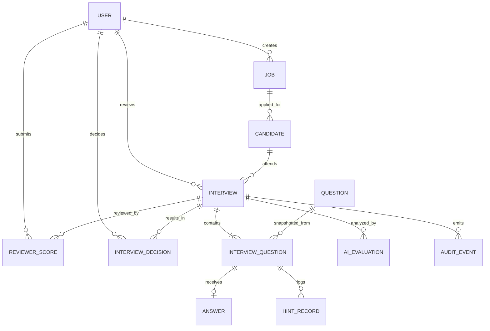

# Talentscope 資料模型

> 目前正式資料庫 schema 為空。本文件先將 `DemoApp.tsx` 的資料與畫面需求正規化，作為 Proposed Data Model；「目前存在」欄位嚴格區分程式碼常數、React state 與尚未存在的實體。

## 1. 建模原則

- 面試建立後必須保存題目快照，避免原題修改影響歷史作答與評分。
- AI 評分與人工評分分開保存，兩者不可互相覆寫。
- 面試決策必須記錄決策者與決策時間；目前 MVP 尚未做到。
- AI 對話訊息必須包含面試、題目、角色、request、時間、內容、provider 與處理狀態。
- 狀態、分數、答案與決策的重要變更應建立不可任意覆寫的 AuditEvent。

## 2. 實體定義

### User

用途：代表 HR、技術主管等內部使用者；候選人是否共用 User 表由團隊決定。

| 欄位 | 型別 | 必填 | 關聯／說明 | 現況 |
|---|---|---:|---|---|
| id | UUID | 是 | Primary key | Planned |
| email | string | 是 | 唯一登入識別 | Demo 常數僅有顯示值 |
| displayName | string | 是 | 顯示名稱 | Mock |
| role | enum(HR, TECH_LEAD) | 是 | 正式 RBAC 角色 | Planned |
| status | enum | 是 | active/disabled 等 | Planned |
| createdAt, updatedAt | datetime | 是 | 稽核時間 | Planned |

未來補充：組織、團隊、最後登入時間、identity provider subject；敏感資料最小化。

### Job

用途：定義應徵職缺。

| 欄位 | 型別 | 必填 | 關聯／說明 | 現況 |
|---|---|---:|---|---|
| id | UUID | 是 | Primary key | Planned |
| title | string | 是 | 如 Junior Data Analyst | Mock 字串 |
| department | string | 否 | 所屬單位 | Planned |
| description | text | 否 | 職缺摘要 | Planned |
| status | enum | 是 | draft/open/closed | Planned |
| createdBy | UUID | 是 | User | Planned |

### Candidate

用途：保存候選人與聯絡識別資料。

| 欄位 | 型別 | 必填 | 關聯／說明 | 現況 |
|---|---|---:|---|---|
| id | UUID | 是 | Primary key | Planned；MVP 無 id |
| name | string | 是 | 候選人姓名 | Mock `candidate` |
| email | string | 是 | 驗證與聯絡 | Mock |
| jobId | UUID | 是 | Job | MVP 只存 job 字串 |
| ownerHrId | UUID | 是 | User(HR) | Planned |
| createdAt, updatedAt | datetime | 是 | 稽核時間 | Planned |

未來補充：個資同意、資料保留期限、刪除／匿名化狀態；避免保存非面試必要敏感資料。

### Question

用途：可重用題庫題目。

| 欄位 | 型別 | 必填 | 關聯／說明 | 現況 |
|---|---|---:|---|---|
| id | UUID | 是 | Primary key | Mock 使用 number |
| title | string | 是 | 題目名稱 | Mock |
| type | enum(SQL, PROGRAMMING, TECH_QA) | 是 | 題型 | Mock |
| difficulty | enum(EASY, MEDIUM, HARD) | 是 | 難度 | Mock |
| skills | string[]／relation | 是 | 技能標籤 | Mock array |
| description | text | 是 | 題目描述 | Mock |
| detail | text | 否 | schema 或 I/O 說明 | Mock |
| example | text | 否 | 題目範例 | Mock |
| rubric | text／JSON | 是 | 評分標準 | Mock |
| estimatedMinutes | integer | 是 | 預估作答時間 | Mock `minutes` |
| ownerId | UUID | 否 | 自有題目建立者 | Planned |
| sourceUrl, sourceRef | string | 否 | 參考來源 | Planned |
| version | integer | 是 | 版本管理 | Planned |

### Interview

用途：一次候選人面試流程的主記錄。

| 欄位 | 型別 | 必填 | 關聯／說明 | 現況 |
|---|---|---:|---|---|
| id | UUID | 是 | Primary key | Planned |
| candidateId | UUID | 是 | Candidate | MVP 內嵌姓名／email |
| jobId | UUID | 是 | Job | MVP 為字串 |
| leadId | UUID | 是 | User(TECH_LEAD) | MVP 為姓名字串 |
| status | enum | 是 | 九種面試狀態 | Mock／Partial state |
| title | string | 是 | 面試名稱 | Mock |
| dueAt | datetime | 是 | 有效期限 | Mock 字串 |
| startedAt, submittedAt, completedAt | datetime | 否 | 生命週期時間 | Planned／部分固定顯示 |
| durationLimitMinutes | integer | 是 | 作答上限 | Mock 75 |
| createdBy | UUID | 是 | User(HR) | Planned |

九種狀態定義見 [SRS](./SRS.md#8-面試狀態定義)。

### InterviewQuestion

用途：連結面試與題目，並保存不可變的題目快照與順序。

| 欄位 | 型別 | 必填 | 關聯／說明 | 現況 |
|---|---|---:|---|---|
| id | UUID | 是 | Primary key | Planned |
| interviewId | UUID | 是 | Interview | Planned |
| sourceQuestionId | UUID | 否 | Question；刪題後仍保留快照 | Planned |
| orderIndex | integer | 是 | 題目順序 | Mock `selected` array 順序 |
| questionSnapshot | JSON | 是 | 標題、題幹、rubric、版本等 | Planned，必要需求 |
| estimatedMinutes | integer | 是 | 建立面試當下估時 | Mock |
| maxScore | number | 否 | 題目滿分 | Planned |

### Answer

用途：保存面試者對每題的作答與作答過程摘要。

| 欄位 | 型別 | 必填 | 關聯／說明 | 現況 |
|---|---|---:|---|---|
| id | UUID | 是 | Primary key | Planned |
| interviewQuestionId | UUID | 是 | InterviewQuestion | Planned |
| content | text | 否 | SQL、程式碼或文字答案 | React state `answers` |
| language | string | 否 | SQL／程式語言 | UI 固定顯示，未保存 |
| durationSeconds | integer | 是 | 各題停留時間 | Mock 固定顯示 |
| lastSavedAt | datetime | 否 | 自動儲存時間 | Mock UI |
| submittedAt | datetime | 否 | 提交時間 | Planned |

### AIConversationMessage（取代 Sprint 4 的 HintRecord）

用途：記錄候選人與 AI 在單一面試題目內的逐則對話。目前存在於前端記憶體，未寫入資料庫。

| 欄位 | 型別 | 必填 | 關聯／說明 | 現況 |
|---|---|---:|---|---|
| id | UUID | 是 | Primary key | Planned |
| interviewQuestionId | UUID | 是 | InterviewQuestion | MVP 只記 q number |
| interviewId | string | 是 | 所屬面試 | 前端 state |
| questionId | integer | 是 | 所屬題目 | 前端 state |
| role | candidate \| assistant | 是 | 訊息角色 | 前端 state |
| requestId | string | 是 | 將問題與回覆／重試關聯 | 前端 state |
| status | pending \| success \| error | 是 | 回覆處理狀態 | 前端 state |
| provider | Mock | 是 | 明確標示目前 provider | 前端 state |
| errorCode | string | 否 | Mock 失敗代碼 | 前端 state |

正式資料庫需另補 server-side ID、建立者、不可竄改時間、模型／prompt 版本、token 用量、內容安全結果、稽核與資料保存期限。候選人訊息與 assistant 訊息分開保存；重試沿用同一 `requestId`，不複製候選人訊息。
| requestedAt | datetime | 是 | 使用時間 | React state 僅 HH:mm |
| content | text | 是 | 實際提示內容 | 固定 Mock 回覆 |
| provider, modelVersion | string | 否 | AI 可追溯性 | Planned |
| promptVersion | string | 否 | 提示模板版本 | Planned |

### AIEvaluation

用途：保存 AI 對某題或整場面試的輔助評估及證據。

| 欄位 | 型別 | 必填 | 關聯／說明 | 現況 |
|---|---|---:|---|---|
| id | UUID | 是 | Primary key | Planned |
| interviewId | UUID | 是 | Interview | Planned |
| interviewQuestionId | UUID | 否 | 可為逐題或整體 | Planned |
| dimension | enum | 是 | 六個評估面向 | Mock `evals` |
| score | number | 否 | AI 初評 | Mock |
| evidence | text | 是 | 支持判斷的簡短證據 | Mock |
| summary | text | 否 | 整體觀察 | Mock |
| modelVersion, promptVersion | string | 是 | 正式稽核所需 | Planned |
| generatedAt | datetime | 是 | 產生時間 | Planned |

### ReviewerScore

用途：保存技術主管人工評分，與 AI 評分分離。

| 欄位 | 型別 | 必填 | 關聯／說明 | 現況 |
|---|---|---:|---|---|
| id | UUID | 是 | Primary key | Planned |
| interviewId | UUID | 是 | Interview | Planned |
| reviewerId | UUID | 是 | User(TECH_LEAD) | Planned |
| dimension | enum | 是 | 六個評估面向 | React state |
| score | number(1..5) | 是 | 人工分數 | React state |
| note | text | 否 | 評語或證據 | React state `note` 為整體備註 |
| createdAt, updatedAt | datetime | 是 | 稽核時間 | Planned |

### InterviewDecision

用途：保存 HR 最終招募結果。

| 欄位 | 型別 | 必填 | 關聯／說明 | 現況 |
|---|---|---:|---|---|
| id | UUID | 是 | Primary key | Planned |
| interviewId | UUID | 是 | Interview | Planned |
| decision | enum(PASS, REJECT, DISCUSS) | 是 | 通過／不通過／待討論 | React state `result` |
| decidedBy | UUID | 是 | User(HR) | Planned；MVP 未記錄 |
| decidedAt | datetime | 是 | 決策時間 | Planned；MVP 未記錄 |
| reason | text | 否 | 決策理由 | Planned |

### AuditEvent

用途：記錄安全、狀態與評估相關的重要事件。

| 欄位 | 型別 | 必填 | 關聯／說明 | 現況 |
|---|---|---:|---|---|
| id | UUID | 是 | Primary key | Planned |
| actorType, actorId | string／UUID | 是 | User、Candidate 或 System | Planned |
| action | string | 是 | 如 INTERVIEW_SUBMITTED | Planned |
| entityType, entityId | string／UUID | 是 | 受影響實體 | Planned |
| occurredAt | datetime | 是 | 事件時間 | Planned |
| metadata | JSON | 否 | 非敏感事件細節 | Planned |
| ipHash, userAgent | string | 否 | 需依隱私政策決定 | Planned |

## 3. Proposed ER Diagram

## 4. 尚待團隊確認

- Candidate 是否屬於 User，或維持獨立、較低權限的身份模型。
- 多組織／多租戶需求與資料隔離策略。
- 分數是逐題、逐面向或兩者並存；總分計算規則。
- 題庫技能標籤採 JSON、字串陣列或正規化關聯表。
- AI 原始輸入輸出保存期限、遮罩與存取權限。
- AuditEvent 的保存年限、匯出與刪除政策。
- 招募決策是否允許改版；若允許，應保留版本而非覆寫。

正式落地前應先以 [SRS](./SRS.md) 的業務規則建立 schema migration 與 API 契約。
