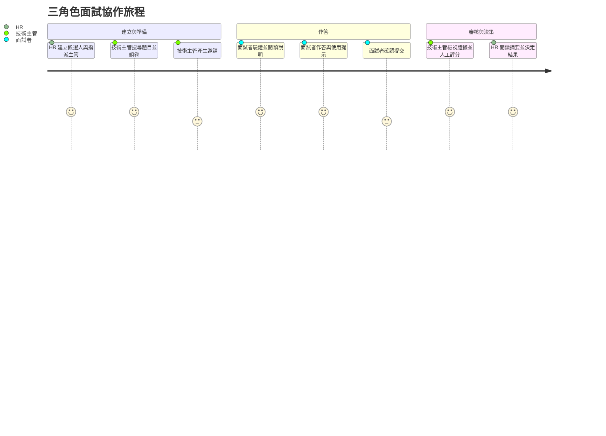
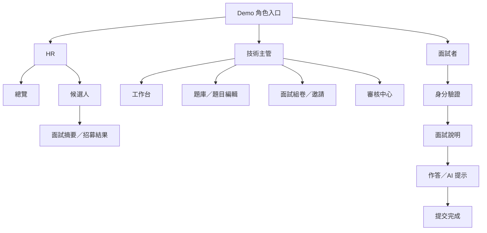

# Talentscope 產品設計文件（PDD）

> 本文件說明產品為誰設計、為什麼這樣設計，以及目前 MVP 的體驗邊界。系統必須做到的細節請見 [SRS](./SRS.md)。

## 1. 產品願景

讓 HR、技術主管與面試者在同一條清楚且可追溯的面試流程上協作；AI 協助候選人推進思路、協助面試官整理證據，但不取代人類的專業與責任。

## 2. 核心問題

- 招募與技術評估分散，HR 不容易掌握下一步。
- 題目選擇與評分缺乏一致結構，交接成本高。
- 候選人不知道面試規則、時間與 AI 提示的使用邊界。
- AI 結果若缺少證據與人工確認，會增加偏誤與責任風險。

## 3. 目標使用者與 Persona

| Persona | 情境 | 需求 | 成功樣貌 |
|---|---|---|---|
| HR 招募專員 | 同時追蹤多位候選人與不同主管 | 快速看進度、期限、待辦及簡明摘要 | 不看詳細程式碼也能完成招募協作與結果紀錄 |
| 技術主管 | 時間有限但要維持題目與評估品質 | 快速找題、估時、檢視答案、AI 證據並人工確認 | 評分有一致面向、證據與備註可交接 |
| 面試者 | 在有限時間內完成遠端技術面試 | 清楚驗證、規則、題目導覽、作答狀態與非答案型提示 | 能專注作答、知道何時儲存及提交後果 |

Persona 是角色模型，不代表真實團隊成員。Demo 中的林佳穎、王柏翰與陳怡安是展示資料。

## 4. 使用情境

主要情境是一場 Junior Data Analyst 技術面試：HR 建立候選人並指派技術主管；主管挑選 SQL 與資料分析問答；面試者驗證後作答並使用提示；主管閱讀作答與 Mock AI 初評後人工評分；HR 查看摘要並選擇招募結果。

## 5. 產品原則

1. **角色聚焦**：HR 看招募進度與摘要；技術主管看答案、提示紀錄與詳細評估；面試者只接觸自己的面試流程。
2. **AI 可解釋、可推翻**：AI 提供初評與證據，人工分數獨立可修改。
3. **不直接給答案**：提示分四級逐步增加具體程度，但不得提供完整答案。
4. **決策由人承擔**：技術建議由技術主管確認；通過、不通過、待討論由 HR 操作。
5. **狀態一致**：所有角色使用相同九種面試狀態名稱。
6. **漸進揭露**：先呈現任務與摘要，再讓需要細節的角色深入。

## 6. 三角色資訊需求

### HR

- 候選人、職缺、技術主管、期限與狀態。
- 需要處理的面試與即將到期項目。
- 完成度、作答時間、提示次數、能力摘要與技術建議。
- 人工設定的招募結果。

HR 不需要逐行程式碼或每個 AI 證據細節。

### 技術主管

- 被指派候選人與組卷進度。
- 題目題型、難度、技能、內容、rubric 與估時。
- 各題答案、停留時間與 AI 提示使用紀錄。
- 六面向 AI 初評、簡短證據、人工分數、備註與技術建議。

### 面試者

- 自己的面試名稱、題數、時間、期限、規則與提交後果。
- 題目內容、答案欄位、題目導覽與儲存狀態。
- 四級提示的目的、內容與紀錄告知。

面試者不應看到其他候選人、題庫管理、AI 評分或內部決策。

## 7. 核心 User Journey

目前旅程只在單一瀏覽器工作階段成立；Email、跨使用者同步與資料持久化仍為 Planned。

## 8. 頁面清單與主要操作

| 頁面／畫面 | 角色 | 目的 | 主要操作 | 現況 |
|---|---|---|---|---|
| Demo 角色入口 | 全部 | 選擇展示視角 | 進入三種 Demo | Mock role switch |
| HR 總覽 | HR | 掌握招募進度與待辦 | 新增候選人、查看詳情 | Implemented UI |
| 候選人列表 | HR | 搜尋與查看候選人 | 關鍵字搜尋、狀態／職缺選單、詳情 | Partial |
| 新增候選人 Modal | HR | 建立候選人與面試 | 填資料、建立 | Mock persistence |
| HR 面試摘要 | HR | 閱讀技術結論與能力摘要 | 更新招募結果 | Mock data/state |
| 技術主管工作台 | 技術主管 | 聚焦組卷與審核待辦 | 開始組卷、進行審核 | Implemented UI |
| 題庫 | 技術主管 | 找到合適題目 | 搜尋、篩選、預覽、加入、編輯 | Implemented／Mock data |
| 題目編輯器 Modal | 技術主管 | 建立或調整自有題目 | 編輯、預覽、儲存草稿 | Mock |
| 面試組卷 | 技術主管 | 排序題目並控制總時間 | 上下移動、移除、前往邀請 | Implemented in memory |
| 邀請結果 | 技術主管 | 取得面試連結與驗證碼 | 複製、標記寄送 | Mock |
| 技術審核 | 技術主管 | 檢視答案、AI 與人工評估 | 切題、評分、備註、完成審核 | Partial／Mock AI |
| 面試驗證 | 面試者 | 確認 Demo 身分 | 輸入 Email 與驗證碼 | Mock verification |
| 面試說明 | 面試者 | 理解時間、題數與規則 | 勾選確認、開始 | Partial |
| 作答頁 | 面試者 | 專注完成題目 | 作答、切題、提示、提交 | Mock persistence/timer |
| 提交完成頁 | 面試者 | 確認已完成 | 查看收據 | Partial／Mock |

## 9. 資訊架構

## 10. UI／UX 設計原則

- 專業、乾淨、柔和藍紫色的企業工具風格。
- 卡片、表格、Badge 與分區表單建立清楚層級。
- 主操作使用實心按鈕，次要操作使用描邊或文字按鈕。
- 關鍵操作提供 Toast、錯誤訊息、Empty State 或確認 Modal。
- 桌面優先，於 1150、820、560px 設定基本 RWD。
- 提交採明確不可逆告知；AI 區塊持續顯示輔助性質。

現有限制：作答頁在窄螢幕隱藏題目導覽與 AI 面板；尚未完成完整鍵盤、讀屏及對比測試。

## 11. AI 功能設計原則

- 提示採四級漸進式揭露，不生成完整答案。
- 每次提示應保存題目、等級、時間、內容；MVP 只在記憶體保存。
- 初評需同時顯示分數與支持證據，避免只有結論。
- AI 與人工評分視覺上分開；人工評分可修改且不可被 AI 覆寫。
- 正式版須記錄模型、prompt 版本、產生時間與失敗狀態。
- AI 失敗不得阻止人工審核，也不得自動決定錄取或淘汰。

## 12. 人工審核機制

技術主管針對題意理解、解題方法、正確性、效率與複雜度、邊界條件、表達與推理六個面向調整 1–5 分，並填寫備註與技術建議。HR 只閱讀摘要，最後選擇通過、不通過或待討論。

目前審核資料為 React state，且完成審核不會完整同步 HR 畫面；正式版必須保存 reviewer、時間、版本與 AuditEvent。

## 13. 成功指標

以下為建議指標，尚未埋點或取得基線：

- 從 HR 建立候選人到邀請完成的中位時間。
- 技術主管完成組卷與人工審核的中位時間。
- 面試到期前完成率、驗證失敗率與提交失敗率。
- 有完整評分面向與備註的面試比例。
- AI 建議被人工修改的比例與原因分布。
- 候選人完成率、提示使用率與作答頁錯誤率。
- 使用者對流程清楚度與公平感的滿意度。

正式 KPI、目標值與埋點責任待團隊確認。

## 14. MVP 與未來版本界線

| MVP 現況 | 未來正式版本 |
|---|---|
| 單頁三角色 Demo | 真實帳號、路由與 RBAC |
| 固定候選人、題目與面試資料 | API 與持久化資料庫 |
| 前端固定驗證 | 短效、可撤銷 Interview Token |
| Toast 模擬寄送／複製／儲存 | Email、clipboard、autosave 與重試 |
| 固定 AI 提示與初評 | 受控 AI Service 與模型稽核 |
| 本地人工評分與結果 | 版本化人工評分、決策者、時間與 Audit Log |

## 15. 已知產品風險

- Demo 角色容易被誤解為正式權限，必須持續標示 Demo。
- AI 可能產生偏誤、幻覺或過度具體提示；需人類確認與內容安全機制。
- 面試資料涉及個資與就業決策，須定義合法用途、保存期限與存取權。
- 遠端面試的網路中斷與自動儲存失敗會直接影響候選人體驗。
- 題目外洩、過度重用或 rubric 不一致會降低評估效度。
- 行動裝置雖可顯示，但目前不是完整作答體驗。

詳細流程見 [USER_FLOWS](./USER_FLOWS.md)，驗證方式見 [TEST_PLAN](./TEST_PLAN.md)。
