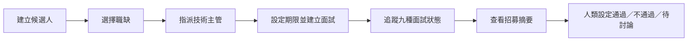
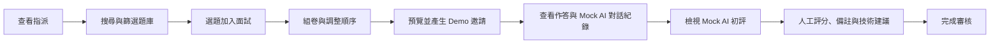
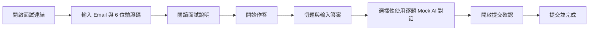

# Talentscope 使用流程

> 狀態標記：Implemented、Mock、Partial、Planned。角色權限目前只是前端 Demo 分流。

## 1. HR 流程

### 主要流程

| 步驟 | 重要畫面 | 成功情境 | 錯誤／例外 | 可完整操作？ | Mock／限制 |
|---|---|---|---|---|---|
| 建立候選人 | HR 總覽、新增候選人 Modal | 姓名、Email、職缺、主管、期限均寫入列表 | 必填、Email 格式或未來期限不合法時顯示錯誤 | Implemented in memory | 僅 React state，重新整理消失 |
| 指派職缺與主管 | 新增候選人 Modal | 職缺由現有候選人資料產生，主管可選擇 | 無 API 驗證主管是否有效 | Implemented in memory | 選項仍來自 Demo 資料 |
| 追蹤狀態 | HR 總覽、候選人列表 | 關鍵字、狀態、職缺可組合篩選；共用面試 Badge 同步 | 查無結果顯示 Empty State | Partial | Demo 面試狀態只在同一 `DemoApp` 工作階段同步；統計卡仍為固定資料 |
| 查看摘要 | 陳怡安面試摘要 | 看到技術建議、完成度與能力摘要 | 其他候選人沒有完整詳情 | Partial | 摘要為固定 Demo |
| 作出決策 | 更新招募結果 Modal | 選擇通過、不通過或待討論 | 未記錄決策者、時間或理由 | Mock | 本地 state；AI 不自動決策 |

### HR Happy Path

進入 HR Demo → 新增候選人 → 查看候選人列表 → 開啟陳怡安詳情 → 閱讀摘要 → 更新招募結果。介面可連續操作，但建立與結果都沒有持久化。

## 2. 技術主管流程

### 主要流程

| 步驟 | 重要畫面 | 成功情境 | 錯誤／例外 | 可完整操作？ | Mock／限制 |
|---|---|---|---|---|---|
| 查看指派 | 技術主管工作台 | 看到林冠宇待組卷、陳怡安待審核 | 無真實指派或權限驗證 | Mock | 固定卡片與統計 |
| 搜尋題庫 | 題庫 | 依關鍵字、題型、難度、技能縮小結果 | 無結果顯示 Empty State | Implemented | 12 題固定資料 |
| 選題組卷 | 題庫、面試組卷 | 加入、移除、上下排序並計算總時間 | 無題目時按鈕停用 | Implemented in memory | 拖曳文字僅視覺；實際用箭頭 |
| 建立邀請 | 邀請頁 | 顯示連結、6 位碼與期限 | 無 token／Email 失敗處理 | Mock | 複製與寄送只顯示 Toast |
| 查看作答 | 審核中心 | 切換三題，看到答案、停留時間與提示 | 答案均為固定 Demo | Mock | 無真實提交資料 |
| AI 初評 | 審核中心 | 看到六面向分數與證據 | 無 AI 失敗／重試狀態 | Mock | 固定 `evals` |
| 人工審核 | 審核中心 | 修改分數、備註與建議後顯示成功 | 未驗證備註、未保存建議 | Partial | state 不持久化，未完整同步 HR |

### 技術主管 Happy Path

進入技術主管 Demo → 開啟題庫 → 搜尋或篩選 → 選題 → 前往組卷 → 調整順序 → 產生邀請 → 回審核中心 → 切題閱讀 → 修改分數與備註 → 完成審核。

## 3. 面試者流程

### 主要流程

| 步驟 | 重要畫面 | 成功情境 | 錯誤／例外 | 可完整操作？ | Mock／限制 |
|---|---|---|---|---|---|
| 開啟與驗證 | 面試驗證頁 | `yian.chen@example.com`＋`482916` 進入說明 | 錯誤資料顯示表單錯誤 | Mock | 固定前端比對，無過期／鎖定 |
| 閱讀說明 | 面試說明頁 | 確認框預設未勾選，勾選後才能開始並切換為「作答中」 | 未勾選時開始按鈕停用 | Implemented | 時間與題數為此 Demo 固定配置 |
| 作答 | 作答頁 | 75 分鐘倒數持續遞減，切題與更新答案不重置 | 重新整理即遺失；無斷線復原 | Partial | 答案只在工作階段 state；沒有自動儲存持久化 |
| 使用 AI 協作 | AI 對話面板 | 每題獨立訊息、pending、成功、錯誤與重試 | Mock 回覆失敗可重試；提交後鎖定 | Mock | 自由輸入；固定規則回覆，非正式 AI |
| 提交 | 提交確認 Modal | 顯示完成／未完成數與未作答清單，可返回或提交未完成答案 | 手動與逾時共用提交函式，重複提交由單次 guard 阻擋 | Implemented in memory | 只切換前端 view/state，無後端收件確認 |
| 完成 | 提交完成頁 | 顯示實際完成題數、已提交狀態與提示次數，沒有返回作答操作 | 無正式收據 ID 或後端確認 | Implemented UI／Mock receipt | 關閉／重整不保留 |

### 面試者 Happy Path

進入面試者 Demo → 輸入 Demo 驗證資料 → 閱讀說明 → 開始 → 逐題輸入 → 使用任意提示 → 提交確認 → 完成頁。

## 4. 跨角色交接限制

目前三角色可看到同一故事背景，但不是完整事件同步：

- 面試者答案與 AI 對話只存在 `CandidateFlow` 記憶體 state；技術審核顯示的是另一組固定 Mock 對話，尚未跨角色同步。

候選人切換題目時，各題對話分開呈現；延遲回覆仍依 request 回到原題。提交後可在完成頁閱讀既有成功訊息，但不能再輸入或重試。
- 技術主管完成審核只顯示 Toast；HR 摘要與分數是固定 Demo。
- HR 新增候選人只影響當前 `DemoApp` state，不會出現在技術主管的固定指派卡片。
- 正式版須由後端狀態機、資料庫與 AuditEvent 串起交接。

### Sprint 6A AI 協作流程

作答中輸入訊息 → 前端送往 `/api/candidate-ai` → server 驗證 interview、question、字數與同題有限歷史 → Mock 或 Gemini adapter 回覆 → 訊息依原 questionId 寫回。Pending 時不可重送；切題不改變歸屬；提交後忽略延遲回覆，但既有成功對話仍可閱讀。Gemini 缺設定、逾時、配額、暫時不可用與安全阻擋會顯示可理解錯誤，使用者可主動 Retry。

傳送資料不含 Email、驗證碼、姓名、其他題目、招募結果、HR 備註或技術主管評語。工作階段資料重新整理後不保存。

介面驗收與測試案例見 [TEST_PLAN](./TEST_PLAN.md)。
