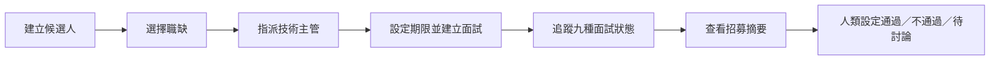
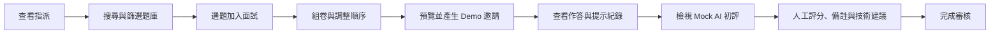
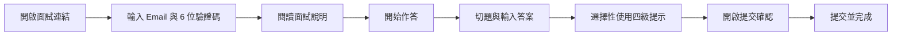

# Talentscope 使用流程

> 狀態標記：Implemented、Mock、Partial、Planned。角色權限目前只是前端 Demo 分流。

## 1. HR 流程

### 主要流程

| 步驟 | 重要畫面 | 成功情境 | 錯誤／例外 | 可完整操作？ | Mock／限制 |
|---|---|---|---|---|---|
| 建立候選人 | HR 總覽、新增候選人 Modal | 必填資料送出後出現在列表 | 姓名／Email 缺漏由 HTML 驗證阻擋 | Partial | 僅 React state，重新整理消失 |
| 指派職缺與主管 | 新增候選人 Modal | 選擇職缺、技術主管、期限 | 無 API 驗證主管是否有效 | Mock | 選項固定 |
| 追蹤狀態 | HR 總覽、候選人列表 | 看到期限與統一 Badge | 狀態選單未實際篩選 | Partial | 指標與大部分狀態固定 |
| 查看摘要 | 陳怡安面試摘要 | 看到技術建議、完成度與能力摘要 | 其他候選人沒有完整詳情 | Partial | 摘要為固定 Demo |
| 作出決策 | 更新招募結果 Modal | 選擇通過、不通過或待討論 | 未記錄決策者、時間或理由 | Mock | 本地 state；AI 不自動決策 |

### HR Happy Path

進入 HR Demo → 新增候選人 → 查看候選人列表 → 開啟陳怡安詳情 → 閱讀摘要 → 更新招募結果。介面可連續操作，但建立與結果都沒有持久化。

## 2. 技術主管流程

### 主要流程

| 步驟 | 重要畫面 | 成功情境 | 錯誤／例外 | 可完整操作？ | Mock／限制 |
|---|---|---|---|---|---|
| 查看指派 | 技術主管工作台 | 看到林冠宇待組卷、陳怡安待審核 | 無真實指派或權限驗證 | Mock | 固定卡片與統計 |
| 搜尋題庫 | 題庫 | 依關鍵字、題型、難度、技能縮小結果 | 無結果顯示 Empty State | Implemented | 12 題固定資料 |
| 選題組卷 | 題庫、面試組卷 | 加入、移除、上下排序並計算總時間 | 無題目時按鈕停用 | Implemented in memory | 拖曳文字僅視覺；實際用箭頭 |
| 建立邀請 | 邀請頁 | 顯示連結、6 位碼與期限 | 無 token／Email 失敗處理 | Mock | 複製與寄送只顯示 Toast |
| 查看作答 | 審核中心 | 切換三題，看到答案、停留時間與提示 | 答案均為固定 Demo | Mock | 無真實提交資料 |
| AI 初評 | 審核中心 | 看到六面向分數與證據 | 無 AI 失敗／重試狀態 | Mock | 固定 `evals` |
| 人工審核 | 審核中心 | 修改分數、備註與建議後顯示成功 | 未驗證備註、未保存建議 | Partial | state 不持久化，未完整同步 HR |

### 技術主管 Happy Path

進入技術主管 Demo → 開啟題庫 → 搜尋或篩選 → 選題 → 前往組卷 → 調整順序 → 產生邀請 → 回審核中心 → 切題閱讀 → 修改分數與備註 → 完成審核。

## 3. 面試者流程

### 主要流程

| 步驟 | 重要畫面 | 成功情境 | 錯誤／例外 | 可完整操作？ | Mock／限制 |
|---|---|---|---|---|---|
| 開啟與驗證 | 面試驗證頁 | `yian.chen@example.com`＋`482916` 進入說明 | 錯誤資料顯示表單錯誤 | Mock | 固定前端比對，無過期／鎖定 |
| 閱讀說明 | 面試說明頁 | 看到 75 分鐘、3 題、規則並開始 | checkbox 未被程式強制檢查 | Partial | 時間與題數固定 |
| 作答 | 作答頁 | 三題切換並在工作階段保留輸入 | 重新整理即遺失；無斷線復原 | Mock | 自動儲存與倒數是靜態文字 |
| 使用提示 | AI 提示面板 | 每次記錄題號、等級、HH:mm 與內容 | 無 AI 失敗／安全過濾 | Mock | 固定四段回覆 |
| 提交 | 提交確認 Modal | 顯示完成題數與不可修改告知 | 未作答仍可提交；無重複提交保護 | Partial | 只切換前端 view/state |
| 完成 | 提交完成頁 | 顯示面試、題數、狀態與提示次數 | 無正式收據 ID 或後端確認 | Mock | 關閉／重整不保留 |

### 面試者 Happy Path

進入面試者 Demo → 輸入 Demo 驗證資料 → 閱讀說明 → 開始 → 逐題輸入 → 使用任意提示 → 提交確認 → 完成頁。

## 4. 跨角色交接限制

目前三角色可看到同一故事背景，但不是完整事件同步：

- 面試者答案與提示紀錄只存在 `CandidateFlow` 元件 state；技術審核顯示的是另一組固定內容。
- 技術主管完成審核只顯示 Toast；HR 摘要與分數是固定 Demo。
- HR 新增候選人只影響當前 `DemoApp` state，不會出現在技術主管的固定指派卡片。
- 正式版須由後端狀態機、資料庫與 AuditEvent 串起交接。

介面驗收與測試案例見 [TEST_PLAN](./TEST_PLAN.md)。
